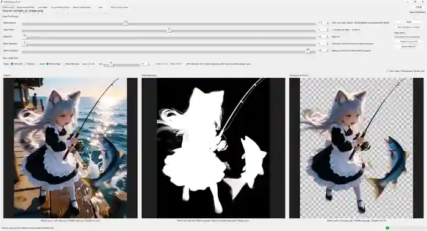

# InSpyCutout

**A lightweight, local background-removal and mask-editing tool powered by InSPyReNet.**

[日本語 README](README_ja.md)



InSpyCutout is designed for a simple workflow: generate a foreground mask automatically, make small corrections, and save a transparent PNG. It works with anime/illustrations, AI-generated images, and many photo-style images.

## Features

- Local image processing after the initial setup
- InSPyReNet `base` model for automatic foreground masks
- Live transparency preview
- Alpha Gamma, Mask Offset, Mask Blur, Black Threshold, and White Threshold controls
- White/black brush editing directly on the mask
- Adjustable brush size with Undo / Redo
- Mouse-wheel zoom and multiple pan controls
- Optional synchronized zoom / pan / fit between the Mask and Transparency Preview panes
- Japanese / English UI switch
- Automatic Paint.NET detection (Microsoft Store and desktop versions)
- Custom external mask editor support
- EXIF orientation handling for camera/smartphone images
- Existing source transparency is preserved
- Edited masks with mismatched dimensions are rejected instead of resized automatically
- Per-image output folders

## Recommended environment

| Item | Recommendation / notes |
|---|---|
| OS | 64-bit Windows 10 or Windows 11 |
| Python | Python 3.11. Setup can install it with `winget` when available. |
| GPU | **NVIDIA CUDA-capable GPU recommended** for fast mask generation. |
| CPU-only | Supported, but AI mask generation can be much slower. |
| AMD / Intel GPU | The current Windows setup does not configure GPU acceleration for these devices, so inference uses the CPU. |
| Memory | 16 GB RAM or more recommended |
| Disk space | Several GB of free space for Python, PyTorch, the model, and local caches |
| Internet | Required for the initial setup and downloads; normal image processing is local afterward |

On NVIDIA systems, Setup installs the official PyTorch CUDA 12.8 build. A reasonably current NVIDIA driver is recommended. No strict minimum VRAM requirement is currently specified.

## Installation

1. Download and extract the release ZIP.
2. Double-click **`Setup.bat`**.
3. Wait for the dedicated Python environment, dependencies, and model to be prepared.
4. Launch InSpyCutout from the desktop shortcut or **`Launch_GUI.bat`**.

InSpyCutout keeps its Python environment in `.venv/` and application-specific caches in `cache/`. It does not install packages into ComfyUI or other Python environments.

If Setup fails, check `setup.log` in the InSpyCutout folder for the full installation log.

## Basic workflow

1. Open a source image.
2. Generate an AI mask.
3. Adjust Alpha Gamma, thresholds, blur, or mask offset while watching the transparency preview.
4. Use the white brush to keep areas or the black brush to remove areas.
5. Save the transparent result.
6. For larger corrections, export the mask to an external editor and reload it afterward.

## Controls

| Action | Control |
|---|---|
| Move mode | `M` |
| Paint mode | `B` |
| Swap white / black brush | `X` |
| Brush size | `[` / `]` or GUI slider |
| Undo | `Ctrl+Z` |
| Redo | `Ctrl+Y` / `Ctrl+Shift+Z` |
| Zoom | Mouse wheel |
| Pan | Move mode + left drag |
| Temporary pan while painting | Hold `Space` + left drag |
| Pan anytime | Middle-mouse drag |
| Fit image | Double-click in Move mode |

When Paint mode is active, double-clicking the editable mask does not trigger Fit. This prevents accidental view resets while painting.

## Mask meaning

- **White** = keep / opaque
- **Black** = remove / transparent
- **Gray** = partially transparent

## View synchronization

The **Sync Mask / Transparency Preview view** option keeps the Mask and Transparency Preview panes on the same image region while zooming, panning, or fitting. It can be turned on or off at any time, and the selected state is saved.

## External mask editor

The default editor mode is **Auto Detect (Recommended)**. InSpyCutout checks for:

1. Paint.NET Desktop
2. Paint.NET from the Microsoft Store
3. Windows **Open with...** if Paint.NET is not found

You can also select a custom executable such as Krita, GIMP, or another image editor.

## Output

For `sample.png`, files are saved under:

```text
output/
  sample/
    sample_cutout.png
    sample_mask.png
    sample_raw_mask.png
    sample_edit_mask.png   # created when exported for external editing
```

## Configuration

Settings are stored in `config.ini`, including UI language, mask defaults, brush settings, editor selection, and view synchronization.

The most common settings can be changed directly from the GUI.

## Removing InSpyCutout

Close the application, back up anything you want to keep from `output/`, then delete the extracted InSpyCutout folder. The application, `.venv`, downloaded model, local caches, settings, and output files are stored there.

Two items may remain outside that folder:

- **Python 3.11** if Setup installed it. Remove it manually from Windows Settings only if you do not use it elsewhere.
- **Desktop shortcut**. Delete it manually if it remains after removing the application folder.

## Credits

Background removal is powered by [transparent-background](https://github.com/plemeri/transparent-background) and [InSPyReNet](https://github.com/plemeri/InSPyReNet).

If you use InSPyReNet in academic work, please refer to the citation information in the upstream project.

## License

InSpyCutout is released under the [MIT License](LICENSE). See [THIRD_PARTY_NOTICES.md](THIRD_PARTY_NOTICES.md) for third-party dependencies and licenses.
